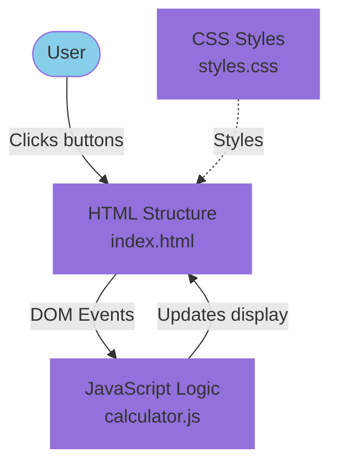
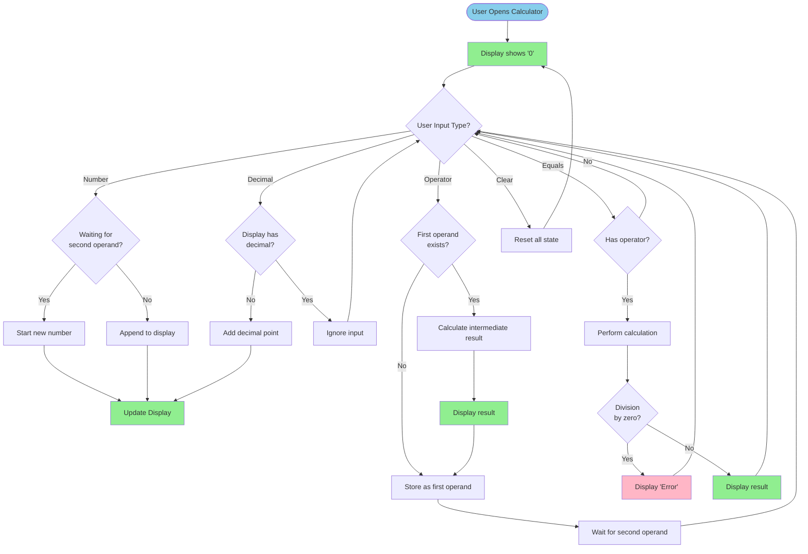
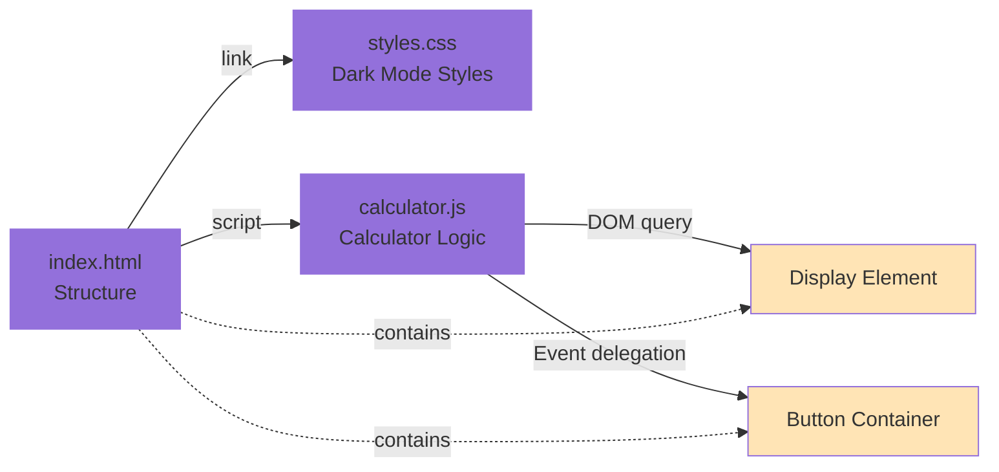
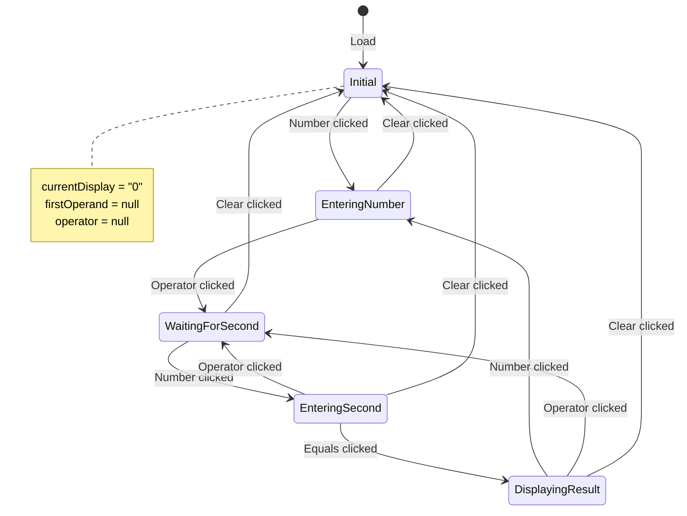

# Web Calculator

A simple, elegant web-based calculator with a dark mode interface built with pure HTML, CSS, and JavaScript.

## Features

- **Basic Arithmetic Operations**: Addition (+), Subtraction (-), Multiplication (×), Division (÷)
- **Decimal Support**: Full support for decimal numbers
- **Operation Chaining**: Perform multiple calculations in sequence (e.g., 2 + 3 + 4)
- **Error Handling**: Gracefully handles division by zero
- **Dark Mode UI**: Eye-friendly dark theme with modern design
- **Responsive Design**: Works on desktop, tablet, and mobile devices
- **No Dependencies**: Pure vanilla JavaScript - no frameworks required

## Architecture

The calculator follows a simple three-layer architecture with clear separation of concerns:

**Component Roles**:
- **HTML**: Defines the calculator structure and layout
- **CSS**: Provides dark mode styling using CSS Grid
- **JavaScript**: Handles all calculation logic and state management

## Usage

### Getting Started

1. Open `index.html` in any modern web browser
2. The calculator will load instantly - no installation or build process required

### Basic Operations

1. **Enter numbers**: Click numeric buttons (0-9)
2. **Decimal numbers**: Click the "." button to add a decimal point
3. **Perform calculations**:
   - Click a number
   - Click an operator (+, -, ×, ÷)
   - Click another number
   - Click "=" to see the result
4. **Clear**: Click "C" to reset the calculator

### Advanced Features

**Operation Chaining**:
- After clicking an operator following a calculation, the result is used as the first operand
- Example: `5 + 3 [+]` → displays `8`, then continue with `8 + 2 [=]` → `10`

**Repeat Operations**:
- Press "=" multiple times to repeat the last operation
- Example: `10 - 2 [=]` → `8`, press `[=]` again → `6` (subtracts 2 again)

### User Interaction Flow

The following flowchart illustrates how user interactions are processed:

## Browser Compatibility

This calculator works in all modern browsers:
- Chrome 60+
- Firefox 60+
- Safari 12+
- Edge 79+

## File Structure

The project consists of four main files with clear dependencies:

**File Descriptions**:
- `index.html` - Main HTML structure with calculator layout
- `styles.css` - Dark mode styling and responsive grid layout
- `calculator.js` - Calculator logic and state management
- `README.md` - This documentation file

## Implementation Details

### State Management

The calculator maintains the following state variables:

**State Variables**:
- `currentDisplay`: Current number shown on screen
- `firstOperand`: First number in a calculation
- `operator`: Selected operator (+, -, ×, ÷)
- `waitingForSecondOperand`: Flag indicating if waiting for second number

### Precision Handling
- Results are rounded to 8 decimal places to handle floating-point precision issues
- Very large numbers (> 999,999,999,999) are displayed in scientific notation
- Common precision issues like `0.1 + 0.2` are handled correctly

### Error Handling
- **Division by zero**: Displays "Error" and resets on next input
- **Invalid states**: Automatically recovers from error states

## Known Limitations

The following features are currently not supported:
- Keyboard input (mouse/touch only)
- Advanced mathematical functions (trigonometry, logarithms, etc.)
- Calculation history
- Memory functions (M+, M-, MR, MC)
- Unit conversion
- Binary/hexadecimal operations

## Development

No build process or dependencies required. Simply edit the files and refresh your browser.

### Testing Checklist

- [x] Basic operations (+, -, ×, ÷)
- [x] Decimal number input
- [x] Operation chaining
- [x] Division by zero handling
- [x] Repeated equals functionality
- [x] Clear button resets state
- [x] Responsive design on different screen sizes
- [x] Visual feedback on button clicks

## License

This project is open source and available for any use.
