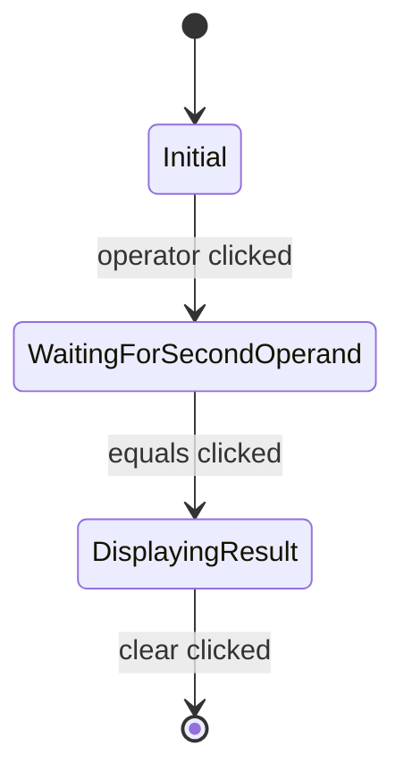
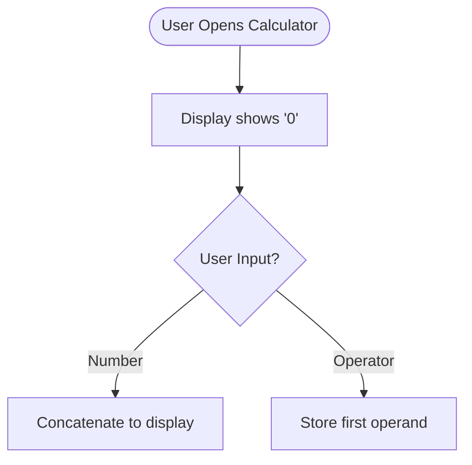
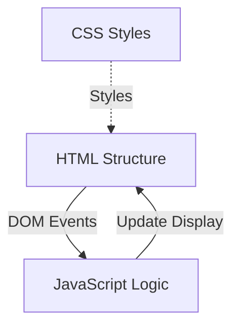

# Design: Add Mermaid Diagrams

## Overview
This change enhances the calculator documentation by adding Mermaid diagrams that visualize the system architecture, state management, and user interaction flows. Mermaid is a JavaScript-based diagramming tool that renders diagrams from text definitions, making it ideal for version-controlled documentation.

## Diagram Types

### 1. State Flow Diagram (State Diagram)
**Purpose**: Visualize the calculator's state machine and transitions between different operational states.

**Content**:
- States: Initial, WaitingForOperator, WaitingForSecondOperand, DisplayingResult, Error
- Transitions: number input, operator input, equals pressed, clear pressed
- State variables displayed: currentDisplay, firstOperand, operator, waitingForSecondOperand

**Location**:
- `openspec/changes/build-web-calculator/design.md` - State Transitions section
- `calculator/README.md` - State Management section

**Mermaid Type**: `stateDiagram-v2`

### 2. Architecture Diagram (Graph/Flowchart)
**Purpose**: Show the component architecture and data flow between HTML, CSS, and JavaScript layers.

**Content**:
- Three main components: HTML (Structure), CSS (Presentation), JavaScript (Logic)
- Data flow arrows showing:
  - HTML emits DOM events → JavaScript
  - JavaScript updates → DOM display
  - CSS styles → HTML elements
- Event delegation pattern highlighted
- Browser rendering layer

**Location**:
- `openspec/changes/build-web-calculator/design.md` - Architecture Overview section
- `calculator/README.md` - Architecture section (new)

**Mermaid Type**: `graph TD` (top-down graph)

### 3. User Interaction Flowchart (Flowchart)
**Purpose**: Document the user's journey through different interaction scenarios.

**Content**:
- Main flow paths:
  1. Number input → operator → number → equals → result
  2. Operation chaining (result → operator → number)
  3. Repeated equals
  4. Clear button reset
  5. Error recovery (division by zero)
- Decision points: "Has operator?", "Division by zero?", "Waiting for second operand?"
- Terminal states: "Display Result", "Display Error", "Reset to 0"

**Location**:
- `calculator/README.md` - Usage section

**Mermaid Type**: `flowchart TD`

### 4. File Structure Diagram (Graph)
**Purpose**: Illustrate the project organization and file relationships.

**Content**:
- Files: index.html, styles.css, calculator.js, README.md
- Relationships:
  - index.html → styles.css (link)
  - index.html → calculator.js (script)
  - calculator.js → display element (DOM reference)
- File descriptions as node labels

**Location**:
- `calculator/README.md` - File Structure section (enhancing existing)

**Mermaid Type**: `graph LR` (left-right graph)

## Diagram Styling Guidelines

### Consistency
- Use consistent color coding across diagrams:
  - User actions: Blue
  - System states: Green
  - Error states: Red
  - Data flow: Gray/Black
  - Components: Purple

### Simplicity
- Keep diagrams focused on core concepts
- Avoid excessive detail that may become outdated
- Use clear, concise labels
- Group related elements

### Accessibility
- Use descriptive node labels
- Ensure sufficient contrast in colors
- Add text descriptions before complex diagrams
- Keep diagrams readable when rendered

## Mermaid Syntax Examples

### State Diagram Example

### Flowchart Example

### Architecture Graph Example

## Documentation Integration Strategy

### README.md Updates
1. Add new "Architecture" section after "Features"
2. Enhance existing "State Management" section with state diagram
3. Add flowchart to "Usage" section showing user flows
4. Keep existing text descriptions and add diagrams as visual supplements

### design.md Updates
1. Replace text-based state transition description with Mermaid diagram
2. Add architecture diagram at the beginning of "Architecture Overview"
3. Keep all existing content - diagrams supplement, not replace

## Validation Strategy

### Syntax Validation
- Use Mermaid Live Editor (https://mermaid.live) to validate syntax
- Test rendering in VS Code with Mermaid preview extension
- Verify rendering on GitHub markdown preview

### Content Validation
- Cross-reference diagrams with actual code implementation
- Ensure state transitions match JavaScript logic in calculator.js
- Verify architecture diagram reflects actual file structure

### Accessibility Validation
- Add descriptive text before each diagram
- Use semantic HTML heading structure
- Ensure diagrams are supplementary to text content

## Maintenance Considerations

### Diagram Versioning
- Diagrams are text-based and tracked in git
- Changes to diagrams appear in pull request diffs
- Easy to review and update alongside code changes

### Update Triggers
Diagrams should be updated when:
- New states are added to the calculator
- Component architecture changes
- Major user interaction flows are modified
- File structure is reorganized

### Simplicity Over Completeness
- Prioritize clarity over exhaustive detail
- Focus on stable, core concepts
- Avoid documenting implementation details that change frequently
