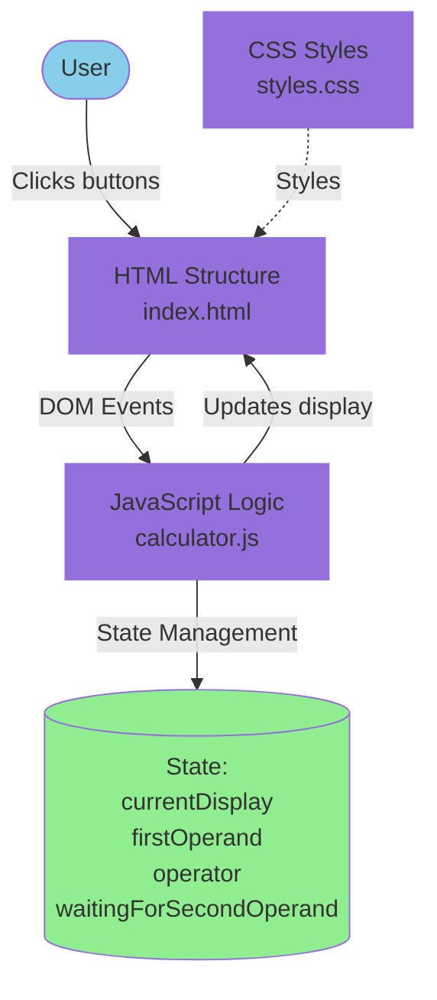
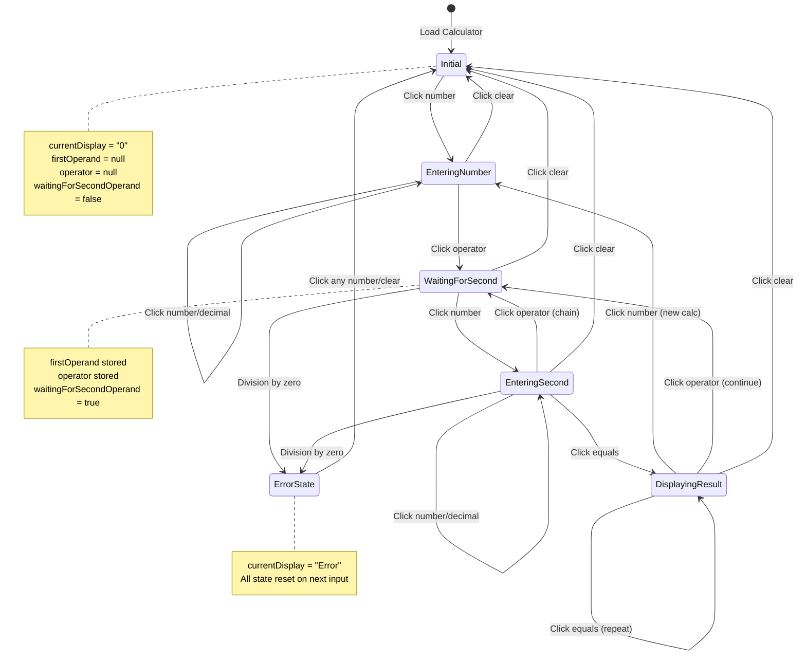

# Design: Build Web Calculator

## Architecture Overview
The web calculator follows a simple client-side architecture with clear separation of concerns:

```
calculator/
├── index.html          # Structure and layout
├── styles.css          # Visual presentation and dark mode theme
└── calculator.js       # Application logic and state management
```

### Component Architecture Diagram

The following diagram illustrates the component relationships and data flow:



### Component Breakdown
1. **HTML (Structure)**: Semantic markup defining the calculator layout
2. **CSS (Presentation)**: Dark mode styling with CSS Grid for button layout
3. **JavaScript (Behavior)**: Event-driven calculator logic with state management

## State Management
The calculator maintains the following state in JavaScript:
- `currentDisplay`: String representing what's shown on screen
- `firstOperand`: Number storing the first value in a calculation
- `operator`: String storing the selected operator (+, -, ×, ÷)
- `waitingForSecondOperand`: Boolean flag indicating input state

### State Transitions Diagram

The following state diagram shows how the calculator transitions between different operational states:



## User Interface Design

### Layout Structure
```
┌─────────────────────────┐
│    Display Screen       │  ← Shows input/result
├─────────────────────────┤
│  C   ÷   ×   -         │  ← Clear and operators
│  7   8   9   +         │
│  4   5   6             │  ← Number grid
│  1   2   3             │
│  0   .   =             │  ← Special buttons
└─────────────────────────┘
```

### Dark Mode Color Scheme
- **Background**: Dark gray/black (#1e1e1e)
- **Display**: Darker shade (#000000) with light text (#ffffff)
- **Number buttons**: Medium dark (#2e2e2e) with light text
- **Operator buttons**: Accent color (#ff9500) with contrast text
- **Special buttons (C, =)**: Distinct colors for visual hierarchy
- **Hover states**: Slight brightness increase
- **Active states**: Visual feedback on click

### Typography
- **Display font**: Monospace or digital-style font for clear number reading
- **Button text**: Sans-serif font for clarity
- **Font sizes**: Larger for display, appropriately sized for buttons

## Calculator Logic

### Arithmetic Operations
```javascript
function calculate(firstOperand, operator, secondOperand) {
  switch(operator) {
    case '+': return firstOperand + secondOperand;
    case '-': return firstOperand - secondOperand;
    case '×': return firstOperand * secondOperand;
    case '÷':
      if (secondOperand === 0) return 'Error';
      return firstOperand / secondOperand;
  }
}
```

### Number Input Handling
- Concatenate digits as strings until operator is pressed
- Convert to number only when performing calculation
- Prevent multiple decimal points in a single number
- Handle leading zeros appropriately (0.5 should work, but 05 should become 5)

### Error Handling
- **Division by zero**: Display "Error" and reset on next input
- **Invalid operations**: Prevent cascading errors by resetting state
- **Overflow**: Limit display length and use scientific notation if necessary

## Event Handling Strategy
Use event delegation on button container for efficient event management:
```javascript
calculatorContainer.addEventListener('click', (event) => {
  if (event.target.matches('.number')) handleNumber(event.target.textContent);
  if (event.target.matches('.operator')) handleOperator(event.target.textContent);
  if (event.target.matches('.equals')) handleEquals();
  if (event.target.matches('.clear')) handleClear();
});
```

## Browser Compatibility
Target modern browsers with ES6 support:
- Chrome 60+
- Firefox 60+
- Safari 12+
- Edge 79+

No polyfills required as we're using standard features available in all modern browsers.

## Performance Considerations
- Minimal DOM manipulation: update display only when needed
- No external dependencies to load
- Total file size < 20KB for fast loading
- Pure JavaScript without framework overhead

## Testing Strategy
Manual testing coverage:
1. **Basic operations**: Test +, -, ×, ÷ with simple integers
2. **Decimal handling**: Test calculations with decimal numbers
3. **Edge cases**:
   - Division by zero
   - Very large numbers
   - Very small numbers (decimals close to zero)
   - Multiple decimal points (should be prevented)
4. **User flow**:
   - Chaining operations (2 + 3 + 4)
   - Clearing mid-calculation
   - Rapid button clicking

## Future Extensibility
While out of scope for this change, the architecture supports future enhancements:
- Add keyboard event listeners for keyboard input
- Extend operator set for scientific functions
- Add history tracking with minimal refactoring
- Implement themes beyond dark mode
- Add memory functions (M+, M-, MR, MC)
